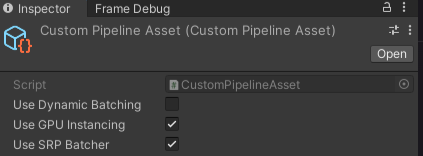
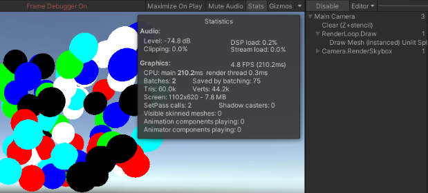
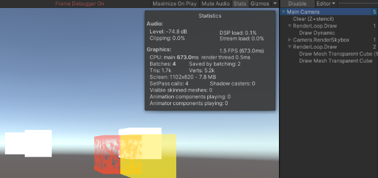
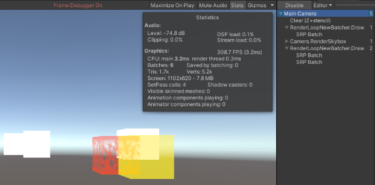

# Draw Calls
참고한 튜토리얼: https://catlikecoding.com/unity/tutorials/custom-srp/draw-calls/

튜토리얼과 달리 GPU 인스턴싱 테스트 용으로 오브젝트(구) 생성을 위해 별도의 스크립트인 ObjectCreator.cs를 사용하였습니다.
Color의 경우 색의 종류가 이 튜토리얼에서 중요한 부분이 아니라고 판단하여 정해진 6가지의 색만 아래처럼 할당해서 배치하였습니다.

렌더파이프라인에서 SRP Batcher, GPU Instancing, Dynamic Batching 사용 여부는 튜토리얼처럼 Pipeline Asset에서 조작하여 테스트해볼 수 있게끔 하였습니다.

## GPU Instancing
똑같은 Material, Mesh를 사용하는 물체들을 하나의 Draw Call에 그리는 방법.
여러 인스턴스들의 Uniform data를 한꺼번에 GPU로 전송함.
만약 GameObject가 SRP Batcher에 호환되면 GPU Instancing 대신 SRP Batcher를 사용함.
-> 이 경우 직접 DrawMeshInstanced 호출하거나 SRP Batcher 호환성 제거해주어야 함.

## Dynamic Batching
동일한 Material을 사용하는 작은 Mesh들을 CPU에서 지오메트리 정보를 연산, 런타임에서 하나의 Mesh로 합치는 방법.
특정 vertex 수 이하(300개) 제한 조건이 있으며 Skinned Mesh는 불가.
GPU Instancing과 마찬가지로 SRP Batcher가 더 우선순위로 실행됨.

## SRP Batcher
동일한 Shader Variant를 사용할 경우 Material Property를 캐싱하여 SetPass를 줄이는 방법.
Draw Call 숫자가 줄진 않음.

테스트는 Assets/CustomSRP/CustomSRP.unity Scene 파일로 가능합니다.