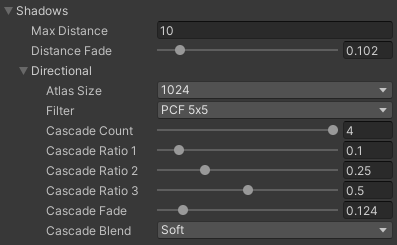
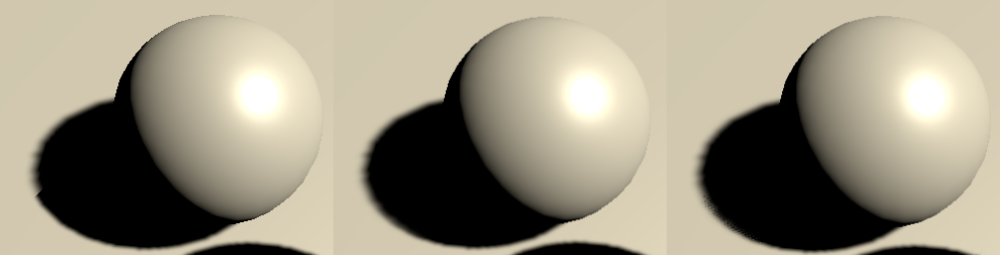

# Directional Shadows
Assets/CustomSRP/ShaderLibrary 및 Assets/CustomSRP/Shaders 폴더에 구현하였습니다.
(Shadows.hlsl, ShadowCasterPass.hlsl, Light.hlsl, Lighting.hlsl)

Custom Pipeline Asset에 설정되어 있는 Shadow 세팅 및
Unity의 기본 Directional Light에 설정되어 있는 값(Normal Bias)을 활용합니다.

## Shadow Settings

### Sampling
SampleDirectionalShadowAtlas 함수에서 직접적인 Sampling을 진행.
GetDirectionalShadowAttenuation 함수에서 위 함수 호출.

### Shadow Atlas
Directional Light가 2개 이상일 경우 설정된 Atlas size를 split하여 사용.
최대 4개 Directional Light 지원.

## Cascaded Shadow Maps
Directional Light는 max distance까지 포함된 모든 물체들에 영향을 미치므로 Shadow map이 많은 영역을 커버하게 됨.
Shadow map은 orthographic projection을 활용하고 각 texel은 고정된 world-space를 가짐. 이에 해상도가 낮을 수록 부정확한 결과를 갖게 됨.
따라서 가까이에 있는 물체는 더 높은 해상도의 Shadow map을 적용하고, 멀리 있는 물체는 낮은 해상도의 map을 적용하는 방식을 고려함.

어떤 Cascade Index를 쓸 건지 거리 판단 = Culling Sphere를 활용.

## Shadow Acne
Slope-Scaled Dpeth Bias과 Normal Bias를 활용하여 Acne 현상 상쇄

Slope-Scaled Bias
- 기본적인 Depth Bias과 비슷하지만, View direction과 surface의 기울기를 기준으로 bias를 적용.

Normal Bias
- Depth Bias는 light 방향으로 offset을 주는 방법인데 반해, surface의 normal 방향으로 옮기는 방법.

### [PCF Filtering](https://youtu.be/TcbvOvmLSow)
픽셀마다 Shadow Map을 여러번 비교하여 평균내는 방법.
주변 픽셀들을 같이 계산하여 평균내기 때문에 비교하는 픽셀이 Shadow에 되어있어도 주변 픽셀 중 Light가 들어간 부분이 있으면 어느 정도 밝아짐.
이를 통해 Hard한 경계(Edge)가 아닌 상대적으로 soft한 shadow를 만들어낼 수 있음.

### Cascade Blend
다른 Cascade Map을 사용할 경우 해상도가 다르기 때문에 그림자가 Cascade 적용 경계에서 확 변하는 느낌이 발생함.
이런 Hard한 것을 보완해주는 방법으로 Soft, Dither를 구현.

왼쪽부터 Hard, Soft, Dither